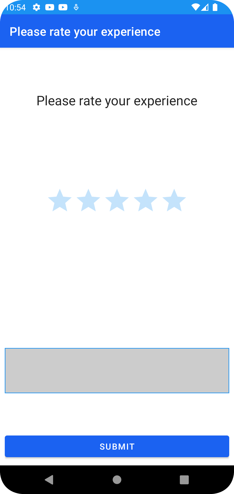
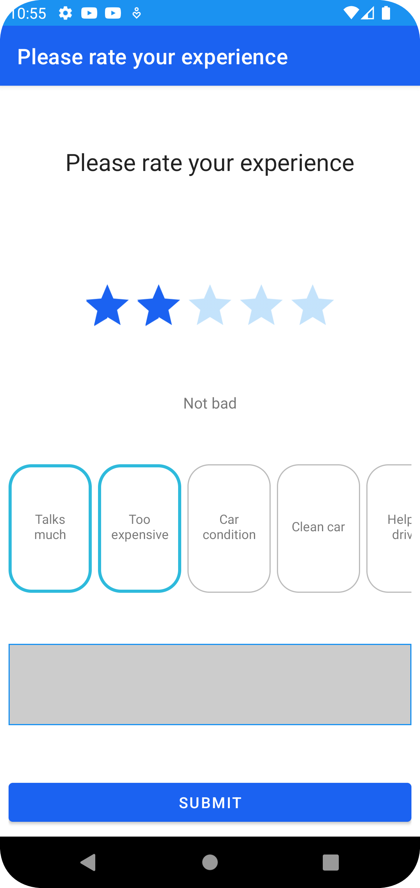
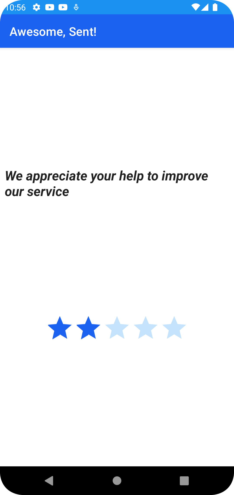

[](https://jitpack.io/#feebaio/feeba-android)
[](https://jitpack.io/#feebaio/feeba-android)
[](https://jitpack.io/#feebaio/feeba-android)

# Feeba Android library

* [Overview](#overview)
* [UI](#ui)
* [Backend logic](#backend-logic)

## Overview

This page provides the information how to integrate android application. Feeba provides an Android client libraries that are published to jitPack. Library has client implementations of Feeba features. Usually all features can be used in two modes. Headless and Headed(Default UI) mode. Client libraries work with server implementation that could be find here - [feeba service](https://github.com/feebaio/feeba-service).

Feeba Android libraries are located in [this repo](https://github.com/feebaio/feeba-android).

**NOTE**: Before integrating android application, Feeba backend service must be configured by:

- Generating API token. It will be used to authenticate android app with the backend service
- Providing pop-up message description
- Tag messages
- Rate limit

Please refer to [quick-start](/quick-start) documentation of how to create proper configuration.

## Integration

Feeba Android client library is delivered in two modules. Core and RateMe. Both are published to jitPack.

```groovy
implementation 'com.github.feebaio.feeba-android:core:0.0.8'
implementation 'com.github.feebaio.feeba-android:rateme:0.0.8'
```

### Initialization - Headed mode(With Default UI)

Feeba Android comes with existing UI that can be used out of the box. There are two ways to initialize Feeba Android library:

1. RateExpActivity - This is a default activity that can be used to display Feeba UI. It can be started by calling `RateExpActivity.startActivity` static method.

```kotlin
RateExpActivity.startActivity(requireActivity(),
    ServerConfig(hostUrl, langCode, jwtToken),
    UserSpecificContext("info@feeba.io"),
    null,
)
```

hostUrl- Feeba backend service url
langCode - Language code you want to fetch the config for. Ensure you have a config for the language code.
jwtToken - API token generated from Feeba backend service
2. RateExperienceFragment - This is a default fragment that can be used to display Feeba UI. It can be started by calling `RateExperienceFragment.show` static method.

```kotlin
RateExperienceFragment.show(
    supportFragmentManager,
    R.id.fragmentContainer,
    this.classLoader,
    rateExperienceConfig,
    serverConfig,
    withBackStack = false,
    userContext
)
```





#### UI customization
**_wip_**

### Initialization - Headless mode
Feeba android library provides a way to integrate Feeba features without using Feeba UI. This is useful when you want to integrate Feeba features into your existing UI. Feeba android library provides a way to integrate Feeba features without using Feeba UI. This is useful when you want to integrate Feeba features into your existing UI. We expose `RateExperienceViewModel` component that encapsulates all the complexity of communicating with Feeba backend service.
RateExperienceViewModel is recommended to use as a VM part of the MVVM pattern. It can be used as follows:

```kotlin
class HeadlessRateExpActivity : AppCompatActivity() {
  private val viewModel = RateExperienceViewModel(
      ServerConfig(
          hostUrl = ConfigHolder.hostUrl,
          langCode = ConfigHolder.langCode,
          apiToken = ConfigHolder.jwtToken
      ),
      usersContext = UserSpecificContext("info@feeba.io"),
  )
 
 ... 
}
```

#### _Call & Communication patterns_
All the commands to ViewModel are sent directly calling its public functions. ViewModel exposes a `uiState` property that can be used to observe the state of the UI. It is a `StateFlow` that emits `RateExperienceState` objects. `RateExperienceState` is a sealed class that represents the state of the UI. It has the following states:

```kotlin
onFeedbackSubmit(text: String, rating: Float) - Needs to be called when user submits feedback. 
onRateSelected(rating: Int) - Needs to be called when user selects a rating. Eg. User clicks on 5th star.
onTagSelectionUpdate(tag: Tag, isChecked: Boolean)  - Needs to be called when user selects a tag. Eg. User clicks on a tag.
```

It is UI layer's responsibility to listen to events emitted by ViewModel. ViewModel currently emitts the following events:

```kotlin
ConfigLoading - UI should show a loading indicator when this event is received.
RateSelected(val reaction: String) - UI should update the label of the selected rating when this event is received. Showing rating's label is useful to explain the meaning of the rating. 
ConfigLoaded(val config: RateExperienceConfig) - UI should update the UI with the config received from the backend service. 
TagsUpdated(val tags: List<Tag>, val selectionHistory: List<Tag>) - UI should re-render tags that are included in the event
ConfigLoadFailed - This event is emitted when config loading fails. UI should show an error message or just close the window as business logic requires 
Submitting - This event is user's feedback is getting sent to backend 
SubmissionError - This event is emitted when user's feedback submission fails. UI should show an error message or just close the window as business logic requires
SubmissionSuccess(val config: RateExperienceConfig) - This event is emitted when user's feedback submission succeeds. UI should update the UI with the config received from the backend service. 
``` 

### Custom Payload passing
**_WIP_**
