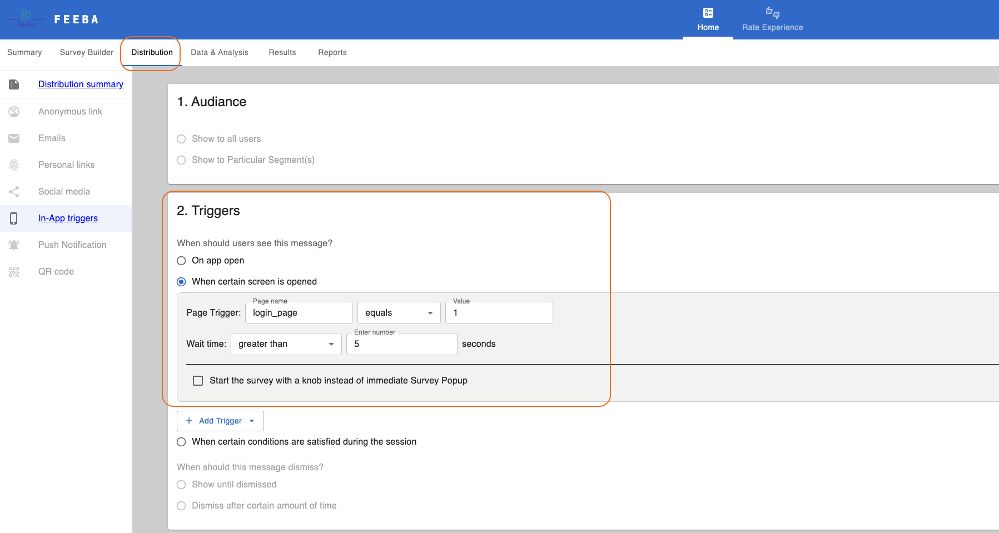
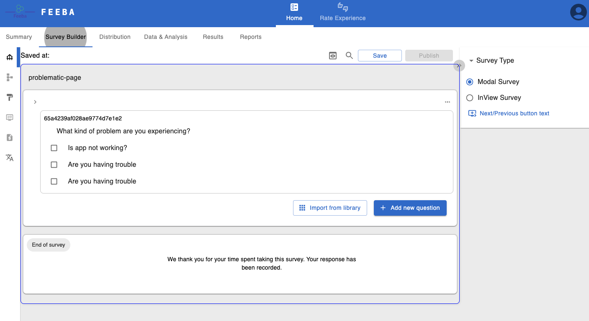
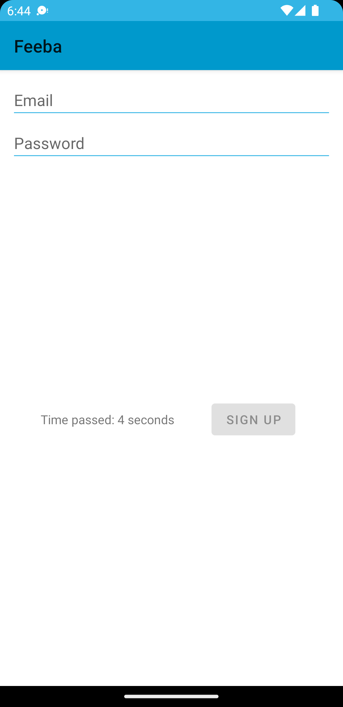
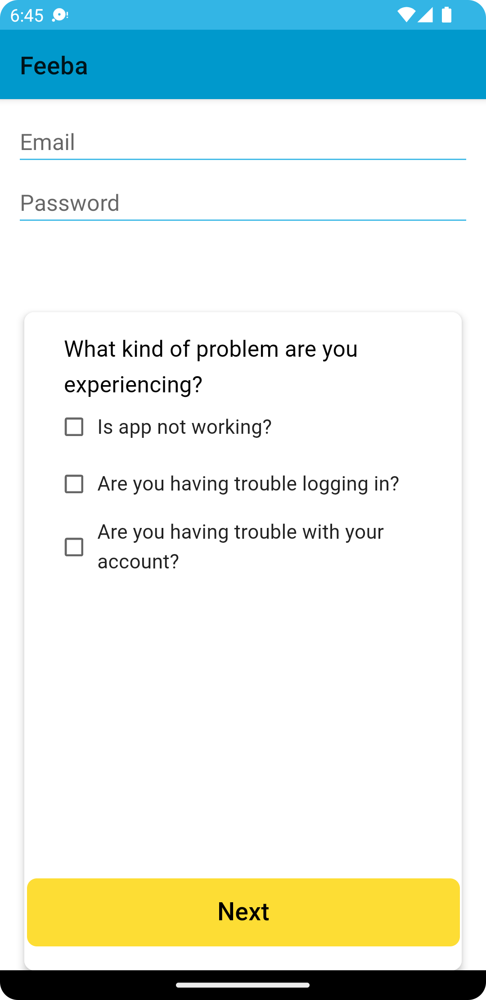
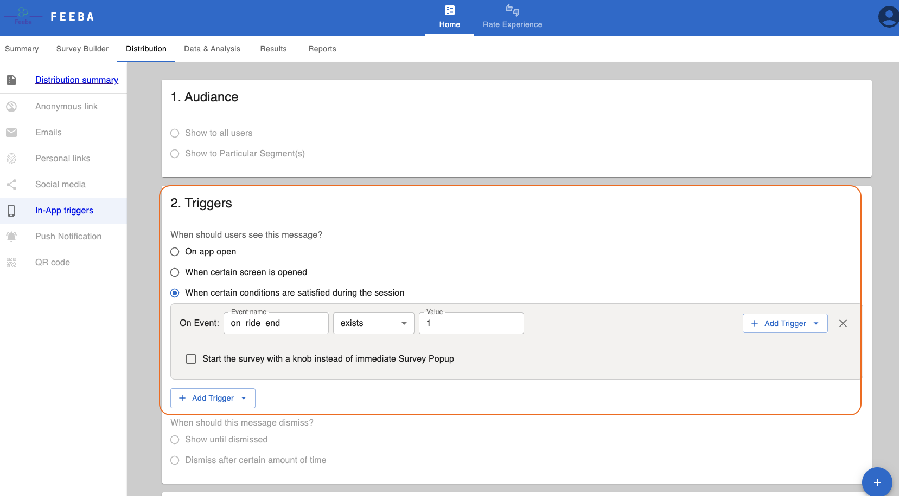
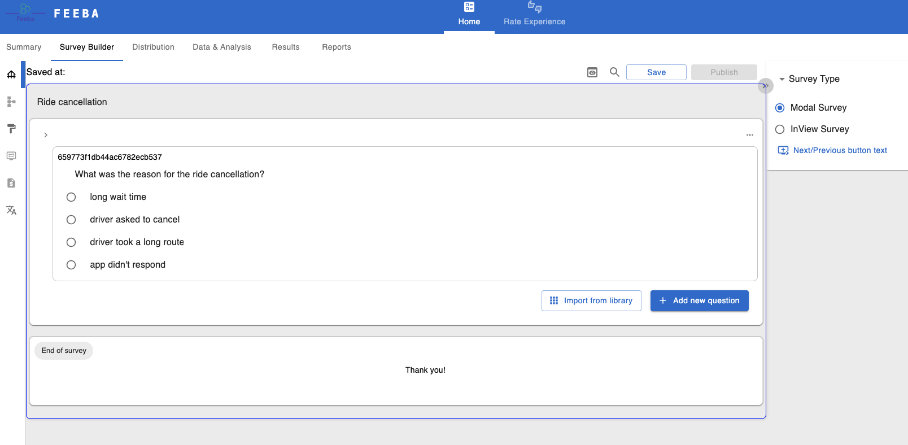
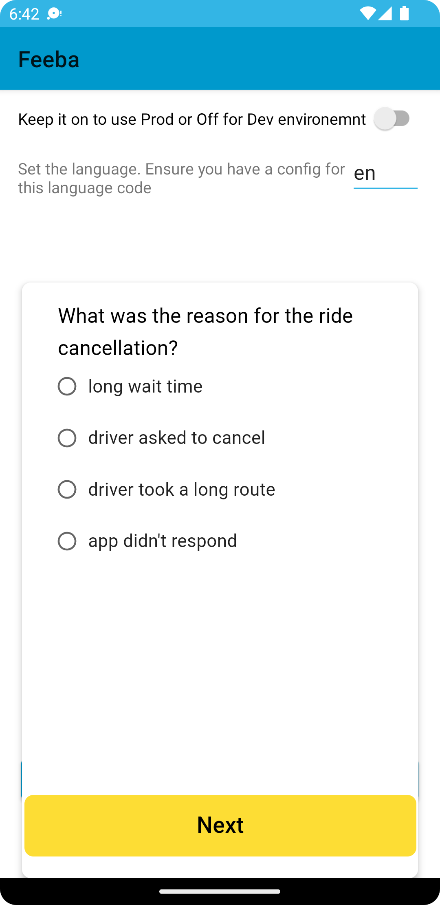

[](https://jitpack.io/#feebaio/feeba-android)
[](https://jitpack.io/#feebaio/feeba-android)
[](https://jitpack.io/#feebaio/feeba-android)

# Feeba Android library

* [Overview](#overview)
* [UI](#ui)
* [Backend logic](#backend-logic)

## Overview

This page provides the information how to integrate android application. Feeba provides an Android client libraries that are published to jitPack. Library has client implementations of Feeba features. Usually all features can be used in two modes. Headless and Headed(Default UI) mode. Client libraries work with server implementation that could be find here - [feeba service](https://github.com/feebaio/feeba-service).

Feeba Android libraries are located in [this repo](https://github.com/feebaio/feeba-android).

**NOTE**: Before integrating android application, Feeba backend service must be configured by:

- Generating API token. It will be used to authenticate android app with the backend service
- Providing pop-up message description

Please refer to [quick-start](/quick-start) documentation of how to create proper configuration.

## Integration

Feeba Android client library is delivered in two modules. Core and RateMe. Both are published to jitPack.

```groovy
	dependencies {
	        implementation 'com.github.feebaio:feeba-android:0.1.7'
	}
```

## Triggers

Currentnly you can set up 2 type of triggers from Survey Dashboard: 
1. When certain screen is opened.
2. When specific condition is satisfied


### When certain screen is opened
In this event you can specify how survey will be displayed based on timer. Click on your survey and go to Distribution menu




This is the sample survey questions:



In this example `login_page` event name specified and there is a wait time of 5 seconds. If a user is in the login page of the android app (it can be any page) and 5 seconds passed, then survey window will pop-up:




Sample code to call from Android code:

```kotlin

    override fun onCreate() {
        super.onCreate()

        // This is how Feeba is initialized. API credentials
        Feeba.init(
            this, ServerConfig(
                hostUrl = ConfigHolder.hostUrl,     // API endpoint
                langCode = "en",                    // default language of the app user
                apiToken = ConfigHolder.jwtToken    // generated token from the Dashboard
            )
        )
    }

    // Some code

    override fun onResume() {
        super.onResume()
        // FEEBA integration. Let Feeba know that the page is opened.
        Feeba.pageOpened("login_page")
    }

    override fun onPause() {
        super.onPause()
        handler.removeCallbacks(runnable)

        // FEEBA integration. Let Feeba know that the page is closed.
        Feeba.pageClosed("login_page")
    }
```

> NOTE: API endpoint is specified in [quick-start](/quick-start)


### When specific condition is satisfied
In this configuration survey is shown when a user reaches specific page. For instance, for the ride-sharing use case, a passanger can get a survey once the survey is finished and the page is displayed.



Sample survey questions:



Sample survey pop-up:



Android code sample:

```kotlin
    private var _binding: FragmentSampleShowcaseBinding? = null
    private val binding get() = _binding!!

    // Define API credentials from previous example

    private val user1 = UserData(
        userId = "test1-user-id",
        email = "test1@example.com",
        phoneNumber = "+1-987-65-43",
        tags = Tags(
            rideId = "test1-user-ride-id",
            driverId = "test1-driver-id"
        )
    )

    override fun onCreate(savedInstanceState: Bundle?) {
        super.onCreate(savedInstanceState)
        Feeba.User.login(user1.userId, user1.email, user1.phoneNumber)
        Feeba.User.setLanguage("en")
    }

    override fun onCreateView(
        inflater: LayoutInflater,
        container: ViewGroup?,
        savedInstanceState: Bundle?
    ): View {
        // some code ...
        binding.onRideEndButton.setOnClickListener {
            Feeba.User.addTag(mapOf("driverId" to user1.tags.driverId, "rideId" to user1.tags.rideId))
            Feeba.triggerEvent("on_ride_end")
        }

        // more code
    }
```


