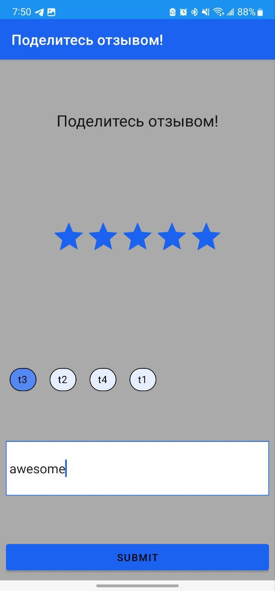

[](https://jitpack.io/#feebaio/feeba-android)
[](https://jitpack.io/#feebaio/feeba-android)
[](https://jitpack.io/#feebaio/feeba-android)


# RateMe Android app

* [Overview](#overview)
* [UI](#ui)
* [Backend logic](#backend-logic) 


## Overview

This repo provides the information how to integrate android application. A client can integrate fully by utilizing already implemented UI or use a manager class, in headless mode, that will communicate with [Least-backend service](https://github.com/codingoperations/least-service). 

**NOTE**: Before integrating android application, least backend service must be configured by:
- Generating API token. It will be used to authenticate android app with the backend service
- Providing pop-up message description
- Tag messages
- Rate limit

Please refer to [least-service](https://github.com/codingoperations/least-service) documentation of how to create proper configuration. 
## Configuration
### Server config

### Custom Payload passing

## With Default UI

Sample UI already includes capability




## Headless mode
#### _Overview_

#### _Integration and Initialization_

#### _Call & Communication patterns_

#### _Exception handling_


This class keeps track of the UI state `RateExperienceState`
T
```kotlin
val uiState: StateFlow<RateExperienceState>
```
The `uiState` gets current state of the UI from `MutableStateFlow`. UI updates are controlled by two important methods:

- onFeedbackSubmit() -> receives 3 parameters
  - text - A text input obtained from the user of the application.
  - rating - A floating number selected by the user.
  - selectedTags - A list of tags selected by the user.
- onRateSelected()   -> receives a rating number and displays corresponding label based on the rating number.

Initially, configurations of `RateExperienceState` must be loaded. Configuration of the `RateExperienceState` is obtained from
MongoDB database.
