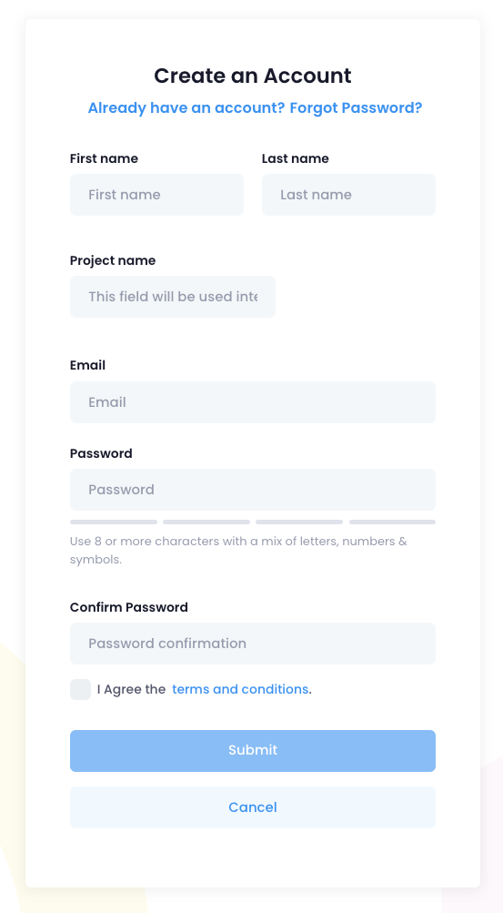
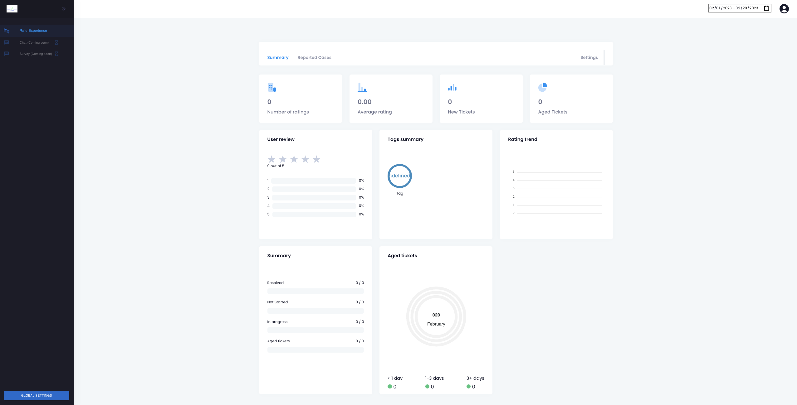
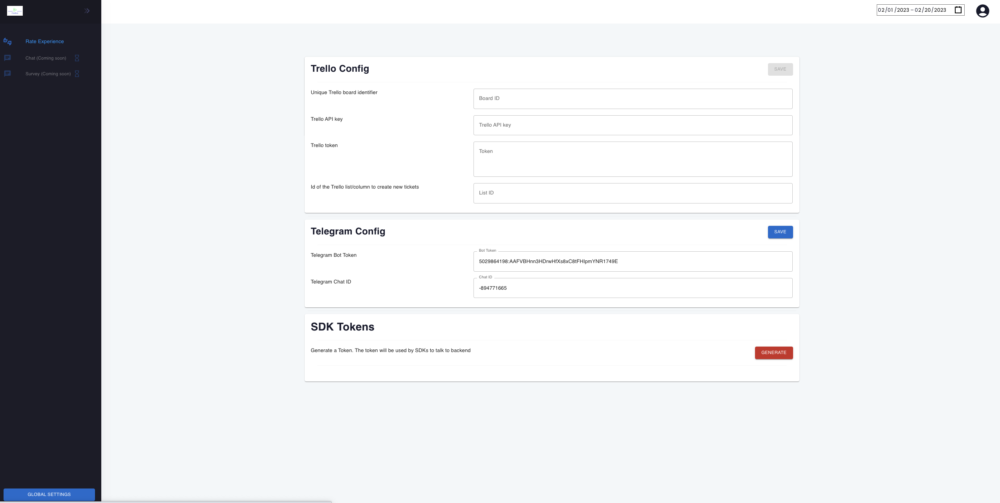
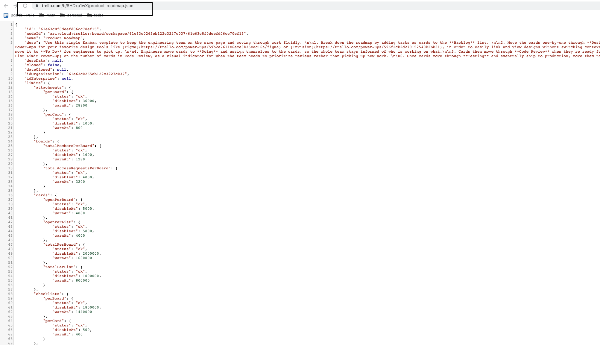

# Account setup
1. Initially, a user needs to create an account with Feeba. 

- Prod  https://dashboard.feeba.io/auth
- Dev   https://dev-dashboard.feeba.io/auth

    > ℹ️ A user may add more projects after creating an account.

2. After creating an account, you will be redirected main page of the dashboard.

3. In order to get rates from different platform, a user needs to add configurations.

# Configurations
You can click on Global settings button, which will redirect you to configuration page. This page is important because you will need to add all token infformation from third-party apps like Trello or Telegram. Currently, only Trello and Telegram supported and new apps will be integrated in the future.

## Global settings
- Trello - section where a user enters all necessary trello private configurations
#### How to get Trello api token:
1. Log in to your Trello account.
2. Go to https://trello.com/app-key to get your API key.
3. Click on the "Generate Token" button to generate a token.
4. A pop-up window will appear. Click on the "Allow" button to give the app access to your Trello account.
5. Your API key and token will be displayed. Keep your API key and token safe as you will need them to access the Trello API.

#### How to get Unique Trello board identifier
1. Log in to your Trello account.
2. Open the Trello board you want to get the identifier for.
3. Look at the URL in your browser's address bar. The board identifier is the 24-character string that appears after the "b/" in the URL. For example, if the URL is "https://trello.com/b/abcdefgh/my-board", the board identifier is "abcdefgh".
4. You can also get the board identifier using the Trello API by making a GET request to the board's API endpoint. The board identifier will be included in the response as the "id" property.

#### How to get ID of the Trello list/column to create new tickets
1. Log in to your Trello account.
2. Open the Trello board that contains the list/column where you want to create new tickets.
3. Click on the list/column to open it.
4. Look at the URL in your browser's address bar. The list/column identifier is the 24-character string that appears after the "lists/" in the URL. For example, if the URL is "https://trello.com/b/abcdefgh/my-board/lists/ijklmnopqrstu/list-name", the list/column identifier is "ijklmnopqrstu".
5. You can also get the list/column identifier using the Trello API by making a GET request to the list's API endpoint. The list/column identifier will be included in the response as the "id" property.

**NOTE:** You can also get Trello board identifier and colum ID by logging into you trello account, and going to trello board. In the URL of the board append `.json`  to the board which will give you all the ID information.

- Telegram - similar to trello, a section for configuration. Keep in mind you'll need to creat a bot and add it in the channel to receive all updates throug dashboard.
- SDK Token - you need to generate token and use that token in the integrated apps and platforms. See Android and iOS sections how to use this token.

## Future integrations
- Slack
- Jira
