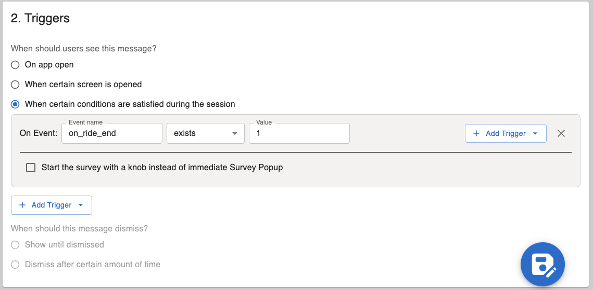
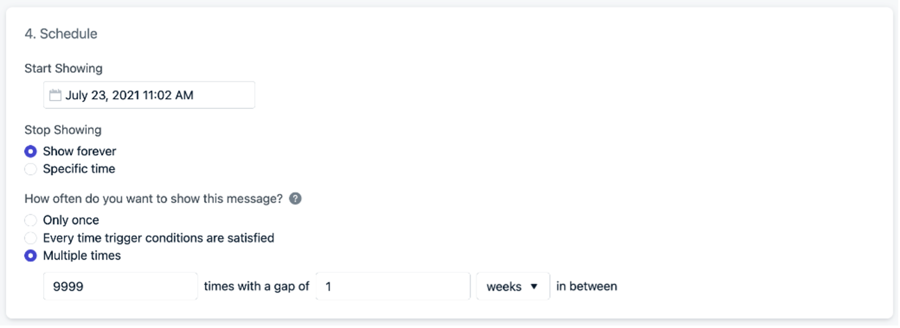
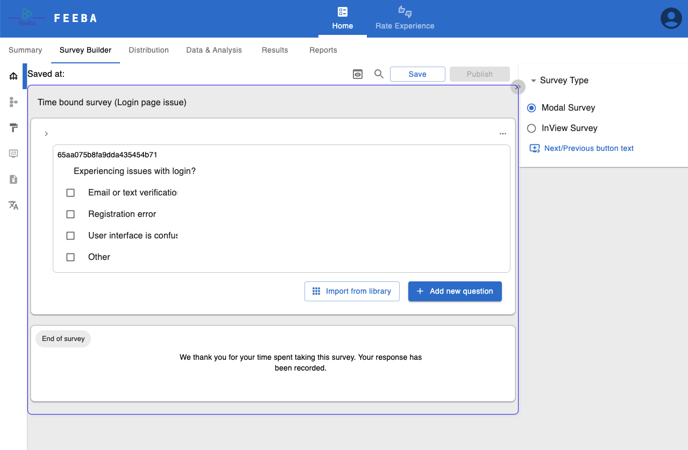
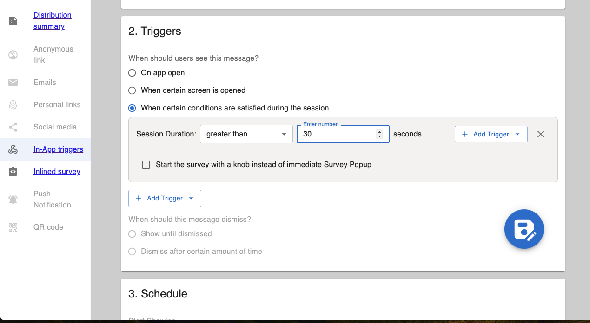
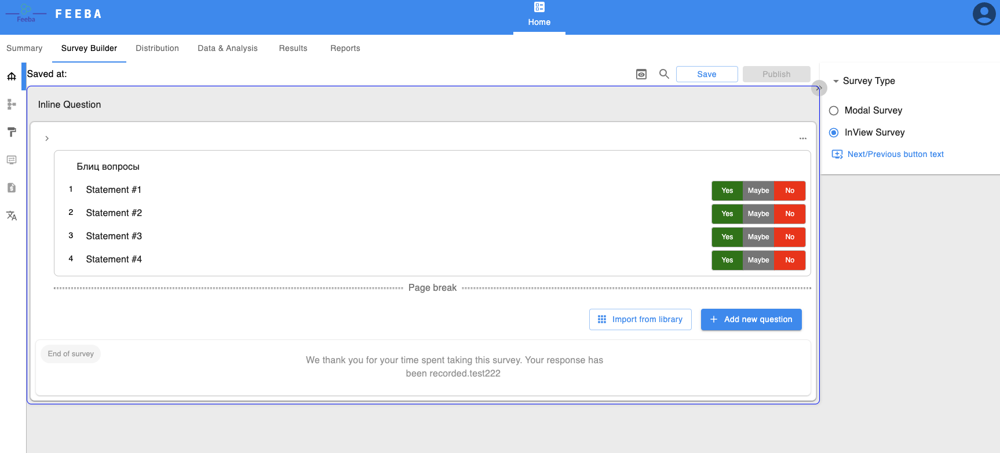
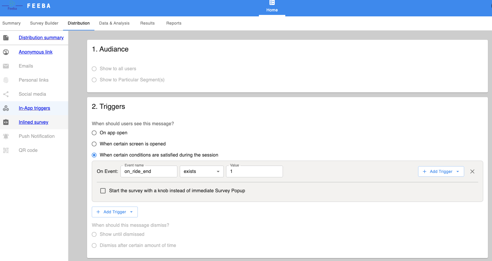

## Example: Ride cancellation (Android SDK)
Surveys are a great way to ask users to provide feedback on their experience using your product / App. This guide will navigate you on how to set that up in your SDK. 

### Step 1: Create a survey
In Feeba dashboard, navigate to Survey Builder > Create Survey to create a survey that you plan to distribute to your users. Check out our “Survey templates” to use.

 

To design and apply formatting, refer to our “Create Survey” guide

### Step 2. Determine distribution method
Once the survey is created and saved, navigate to __Distribution Summary__ to determine which method to use to distribute surveys. There are options to send surveys via email, personal links, in-app triggers and more.

### Step 3. Triggers – when to display?
Navigate to In-App triggers tab, and consider options to when to display the survey. Depending on your app, you may want to display this survey immediately "On app Open". If you are more technical and want to display it after a specific action, you can programmatically set the trigger, see the Triggers Guide for more details.

> For this example, we will trigger the in-app survey to display after the user cancelled the ride, but you can set any trigger you want.

Select When certain conditions are satisfied during the session radio button, type Event name (ride_cancel), and type 1 for value. This will ensure that the survey will be triggered to the user when the session condition is met (i.e. when the user cancels the ride).

Once the trigger is added, save actions by clicking Save button on the right bottom of the page.

### Step 4. Schedule (coming soon)
__Start Showing__ is the date and time you want the message to begin displaying to users. If the specific time set has not been reached, the message cannot be triggered.

__Stop Showing__ is the time after which the message cannot be triggered any longer. In this case, we want to Show forever which means it will show until you Pause or Delete the message.

How often do you want to show this message?
* __Only once__ is default. The in-app message will only show 1 time on the current device.
* __Every time trigger conditions are satisfied__ will show this message each time the Trigger conditions are met.
* __Multiple times__ allows you to set the specific amount of times this message can be shown and how long to wait in between each display.

For example, we want this message to show until the user rates the app, but we don't want to be too annoying. If we set a large number like 9999 times with a gap of 1 __weeks__ in between" - The message will be allowed to trigger a total of 9999 times. The first time when the triggers are met, then the 2nd time when the triggers are met and 1 week has passed.

### 5. Generate SDK
Please refer to [android setup](android.md) for a SDK generation and code samples

## Example: Time bound surveys (Android SDK)
Surveys are a great way to ask users to provide feedback on their experience using your product / App. When your users are stuck while using the app or issues registering with your app, or overall navigating through your App, you can trigger surveys to understand what issues they are facing. This guide will navigate you on how to set that up in your SDK. 

### Step 1: Create a survey
In Feeba dashboard, navigate to Survey Builder > Create Survey to create a survey that you plan to distribute to your users. 

Check out our “Survey templates” to use.

 

### Step 2. Determine distribution method
Once the survey is created and saved, navigate to Distribution Summary to determine which method to use to distribute surveys. There are options to send surveys via email, personal links, in-app triggers and more.

 

### Step 3. Triggers – when to display?
Navigate to __In-App triggers__ tab, and consider options to when to display the survey. Depending on your app, you may want to display this survey immediately "On app Open". If you are more technical and want to display it after a specific action, you can programmatically set the trigger, see the Triggers Guide for more details.

For this example, we will trigger the in-app survey to display after the user has been in the current session greater than 30 seconds, but you can set any timeframe you want. If an user stuck in the registration or login page for more than 30 seconds, you can trigger the survey to understand their issue.

Select __When certain conditions are satisfied during the session__ radio button, select __Session Duration__ from the drop down. Select __Greater than__ and type 30 for value. This will ensure that the survey will be triggered to the user when the session condition is met (i.e. when the user has been in the current session for 30 sec or more).

 

Once the trigger is added, save actions by clicking Save button on the right bottom of the page.

### Step 4. Schedule (coming soon)

__Start Showing__ is the date and time you want the message to begin displaying to users. If the specific time set has not been reached, the message cannot be triggered.

__Stop Showing__ is the time after which the message cannot be triggered any longer. In this case, we want to __Show forever__ which means it will show until you Pause or Delete the message.

How often do you want to show this message?

* __Only once__ is default. The in-app message will only show 1 time on the current device
* __Every time trigger conditions are satisfied__ will show this message each time the Trigger conditions are met.
* __Multiple times__ allows you to set the specific amount of times this message can be shown and how long to wait in between each display.

For example, we want this message to show until the user rates the app, but we don't want to be too annoying. If we set a large number like 9999 times with a gap of 1 __weeks__ in between" - The message will be allowed to trigger a total of 9999 times. The first time when the triggers are met, then the 2nd time when the triggers are met and 1 week has passed.

### Step 5. Generate SDK
Please refer to [android setup](android.md) for a SDK generation and code samples

## Example: Blitz surveys (Android SDK)
Blitz surveys are a great way to ask users to provide feedback on their experience using your product / App. Blitz surveys can be triggered at any point throughout the customer journey. This guide will navigate you on how to set that up in your SDK. 

### Step 1: Create a survey
In Feeba dashboard, navigate to Survey Builder > Create Survey to create a survey that you plan to distribute to your users. 

### Step 2. Determine distribution method
Once the survey is created and saved, navigate to Distribution Summary to determine which method to use to distribute surveys. There are options to send surveys via email, personal links, in-app triggers and more.

### Step 3. Triggers – when to display?
Navigate to __In-App triggers__ tab, and consider options to when to display the survey. Depending on your app, you may want to display this survey immediately "On app Open". If you are more technical and want to display it after a specific action, you can programmatically set the trigger, see the Triggers Guide for more details.

For this example, we will trigger the in-app survey to display after the service has been provided (Ex. completed the ride).

Select When certain conditions are satisfied during the session radio button, type Event name (on_ride_end), and type 1 for value. This will ensure that the survey will be triggered to the user when the session condition is met (i.e. when the user cancels the ride).

Once the trigger is added, save actions by clicking Save button on the right bottom of the page.

### Step 4. Schedule (coming soon)

Start Showing is the date and time you want the message to begin displaying to users. If the specific time set has not been reached, the message cannot be triggered.

Stop Showing is the time after which the message cannot be triggered any longer. In this case, we want to Show forever which means it will show until you Pause or Delete the message.

How often do you want to show this message?

- Only once is default. The in-app message will only show 1 time on the current device.
- Every time trigger conditions are satisfied will show this message each time the Trigger conditions are met.
- Multiple times allows you to set the specific amount of times this message can be shown and how long to wait in between each display.

For example, we want this message to show until the user rates the app, but we don't want to be too annoying. If we set a large number like 9999 times with a gap of 1 weeks in between" - The message will be allowed to trigger a total of 9999 times. The first time when the triggers are met, then the 2nd time when the triggers are met and 1 week has passed.

### Step 5. Generate SDK
Please refer to [android setup](android.md) for a SDK generation and code samples
